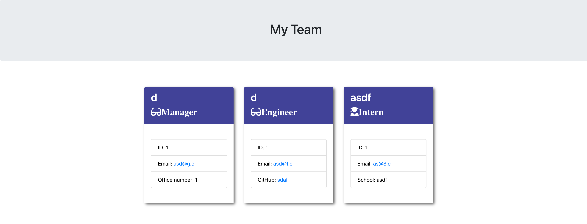

# Team Profile Generator

## Description

This is an application that generates a team profile based on user input. It uses inquirer and jest from node.js and displays the information on a newly created html page.

## Table of Contents
* [Installation](#installation)
* [Usage](#usage)
* [Contributing](#contributing)
* [Tests](#tests)

## Installation 
- Clone repo from Github
- Download and install node, then run this command in project:
    ```
    npm init
    ```
- Then install inquirer and jest from node.js
    ```
    npm i inquirer
    npm i jest
    ```
- If using ES6 modules install babel:
    ```
    npm i @babel/preset-env --save-dev
    ```
## Usage 
Use inquirer from your command line to answer questions about your project.
View walk through video here - [Screencastify](https://drive.google.com/file/d/1kXqO2RwofW_8QawyAVUVZgY8uDXfVxX9/view)<br>


## Contributing 
Contributors should read the installation section. 

## Tests
Run `npm test` to run Jest for tests. 
